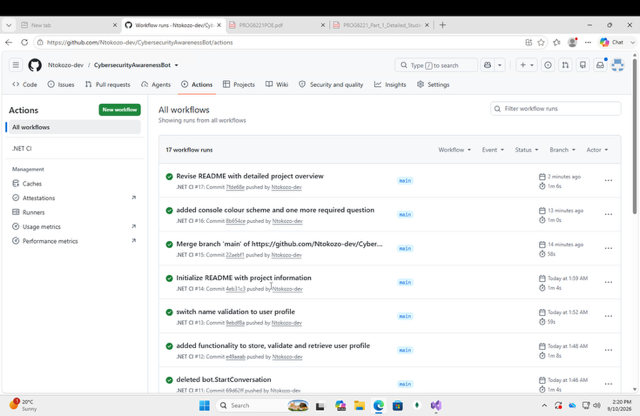

# Cybersecurity Awareness Chatbot
## Student
Name: Ntokozo Mtsali
Student Number:st10498443
## Project Description
A C# console-based cybersecurity awareness chatbot that educates users on identifying and mitigating common cyber threats. The bot greets the user with a voice recording and ASCII art header, asks for their name, and then holds a conversation where the user can ask about password safety, phishing, and safe browsing, as well as general questions about the bot itself.
## Features
- Voice greeting (plays on startup using System.Media.SoundPlayer)
- ASCII art cybersecurity-themed header
- Personalised greeting using the user's name
- Password safety responses
- Phishing responses
- Safe browsing responses
- "How are you?" and "What is your purpose?" responses
- Input validation (blank name and blank query handling)
- Coloured console interface (cyan for menus/headers, green for bot replies, white for user input, yellow for warnings)
- Code organised into separate classes: Program, Chatbot, VoiceGreeting, AsciiArt, ResponseHandler, UserProfile
## How to Run
1. Clone/download the repository.
2. Open the solution in Visual Studio.
3. Ensure greeting.wav is available.
4. Build the project.
5. Press Ctrl + F5.
## Requirements
- Visual Studio 2022
- .NET 8.0
- Windows (for audio playback via System.Media)

## GitHub Actions

## Video Presentation
Unlisted YouTube link:https://youtu.be/qXkjU0DT3Ow?si=PaWWi-lUh0Le26jX
